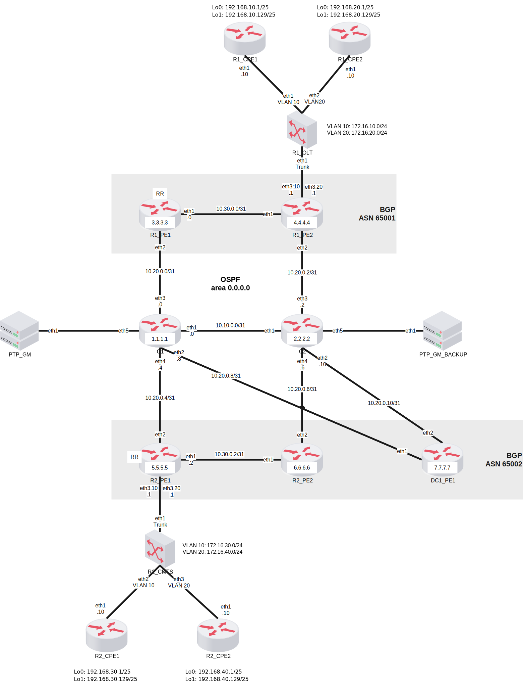

# FRINX Demo Topology

This is a simple topology for testing FRINX topology services.
It consists of MPLS core network, two regions with PE routers and connected CPE routers.

Device types:
- Core, PE, and PTP GM routers: `frinx/vr-sros:22.10.R7`
- CPE routers: `frinx/vr-xrv:6.0.1`
- OLT and CMTS switches: `frinx/vr-sros:22.10.R7`

Configured protocols:
- LDP
- RSVP
- MPLS
- OSPF
- BGP
- PTP
- SyncE
- LLDP

## Logical topology

<div style="background-color: white; display: inline-block;">
    
</div>

## IP addressing

The following table shows management IP addresses and supported management protocols
for each configurable device in the topology:

| Device        | IP address    | CLI (SSH) | NETCONF (SSH) | gNMI  |
|---------------|---------------|-----------|---------------|-------|
| C1            | 172.20.20.11  | 22        | 830           | 57400 | 
| C2            | 172.20.20.12  | 22        | 830           | 57400 |
| R1_PE1        | 172.20.20.111 | 22        | 830           | 57400 |
| R1_PE2        | 172.20.20.112 | 22        | 830           | 57400 |
| R2_PE1        | 172.20.20.121 | 22        | 830           | 57400 |
| R2_PE2        | 172.20.20.122 | 22        | 830           | 57400 |
| DC1_PE1       | 172.20.20.93  | 22        | 830           | 57400 |
| R1_CPE1       | 172.20.20.202 | 22        | 830           |       |
| R1_CPE2       | 172.20.20.203 | 22        | 830           |       |
| R2_CPE1       | 172.20.20.204 | 22        | 830           |       |
| R2_CPE2       | 172.20.20.205 | 22        | 830           |       |
| PTP_GM        | 172.20.20.9   | 22        | 830           | 57400 |
| PTP_GM_BACKUP | 172.20.20.8   | 22        | 830           | 57400 |
| R1_OLT        | 172.20.20.206 | 22        | 830           | 57400 |
| R2_CMTS       | 172.20.20.207 | 22        | 830           | 57400 |

## Building required docker images

Scripts for building of the required docker images that are compatible with containerlab are provided
by the https://github.com/hellt/vrnetlab repository.
See https://containerlab.dev/manual/vrnetlab/#compatibility-matrix for details about compatibility between
containerlab and vrnetlab versions.

The last tested versions of vrnetlab and containerlab:
- vrnetlab: 0.18.1
- containerlab: 0.56.0

### frinx/vr-sros:22.10.R7

Requirements:
- sros-vm-22.10.R7.qcow2 image: Ask Nokia support to provide you with the Qemu disk image.
- sros-vm-22.10.R7.qcow2.license file: Ask Nokia support to provide you with the valid license file.

1. Append the date, when licence starts to be valid, to the end of the file into the comment section
   (comment starts with the # character).
   Format of the date is YYYY-MM-DD.
   Example: # TEST(TiMOS-[BC]-22.*) 2024-01-01

2. Copy 'sros-vm-22.10.R7.qcow2' and 'sros-vm-22.10.R7.qcow2.license' files to the 'sros' directory
   in the vrnetlab repository.

3. Build the docker image using `make docker-image` command.
   Change tag of built docker image to 'frinx/vr-sros:22.10.R7' tag.

### frinx/vr-xrv:6.0.1

Requirements:

- iosxrv-k9-6.0.1.vmdk image: Download the image from the Cisco website with valid subscription model.
  Image is also provided by the Cisco Modeling Labs (CML).

1. Copy 'iosxrv-k9-6.0.1.vmdk' file to the 'xrv' directory in the vrnetlab repository.
2. Build the docker image using `make docker-image` command. 
   Change tag of built docker image to 'frinx/vr-xrv:6.0.1' tag.

## Startup process

To start the topology, run the following command:

```bash
sudo containerlab deploy
```

## Stopping the topology

To stop the topology, run the following command:

```bash
sudo containerlab destroy
```

### Template configurations

You can specify variables that will be used in configuration files using environment variables.
Navigate to the `device_templates` folder. All templates follow the `config_<device_name>.template.txt` pattern.
You can define as many variables as you need. The variables follow the `$VARIABLE_NAME` pattern. R1_PE1 device uses
a variable to set the neighbor IP address `neighbor $R1_PE1_NEIGHBOR_IP`. The variable then needs to be present in the
environment variables (dotenv file).
```shell
export R1_PE1_NEIGHBOR_IP=172.18.0.1
```
After setting up the template and setting up all the environment variables, use the script `substitute_variables.py`
```shell
python3 substitute_variables.py device_templates/config_r1_pe1.template.txt
```
Multiple templates can be added. All of these templates are read, the variables are substituted and the `config_<device_name>.partial.txt`
files are updated.

Parameters defined in dotenv are 1 to 1, so if you want some extra escaping, e.g. putting the variable in quotes, define
it in the template like `"$VARIABLE_NAME"`. To use all variables defined in dotenv, use the following:
```shell
export $(grep -v '^#' .env | xargs -d '\n')
```